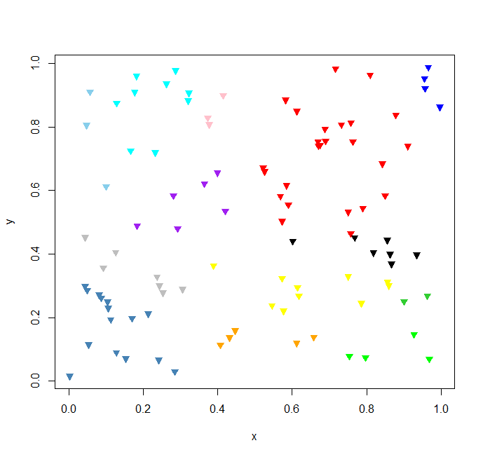

# bclusterTree

a generic data object clustering based on binary tree similarity measurement

## basic usage

### 1. define a index order for compares of any two data elements

such index order function is a kind of function for evaluate the compares order of your data when building a binary tree based on the input data that you assign to the object list.
in binary tree, 0 means identical, 1 means right and -1 means left, so your index order function should produce this 3 integer values, example as:

```R
index = function(a, b) {
	if (abs(a - b) <= 0.1) {
		0
	} else if (a > b) {
		1
	} else {
		-1
	}
}
```

### 2. run data clustering

then we could run the clustering based on the rule that you defined in the index function:

```R
x = runif(100);
c = bcluster(x, index)

# view data result of the clustering
for(name in names(c)) {
	print(name);
	print(x[c[[name]]]);
}
```

## A more complexes demo: clustering 2D points

```R
# raw data
x   = runif(100);
y   = runif(100);
seq = lapply(1:length(x), function(i) list(v = c(x[i], y[i])));
```

we define the raw data set at first, and then we could define an index function based on the data structure that we've defined previous, example like apply the euclidean distance for the ``[x,y]`` vector:

```R
# define compares order
index = function(p1, p2) {
	d = sqrt(sum((p1$v - p2$v) ^ 2));
	
	if (d <= 0.3) {
		0
	} else if (d <= 0.6) {
		1
	} else {
		-1
	}
}
```

Finally we could run the data clustering and data visualization by:

```R
# run clustering
c = bcluster(seq, index);

# plot result data
plot(x, y, pch = 2, col = "white");

i       = 1;
colors1 = c(
	"red", "blue", "green", "yellow", "steelblue",
	"purple", "black", "orange", "gray", "cyan",
	"pink", "skyblue", "limegreen"
);

for(name in names(c)) {
	points(x[c[[name]]], y[c[[name]]], pch=25, col=colors1[i], bg=colors1[i]);
	i = i + 1;
}
```

Run the example demo code, then you should get a image plot looks liked:

